<div align="center">

<!-- Animated Header -->
<div align="center">
  
</div>

<!-- Badges Row 1 -->
<p>
  
  
  
  
</p>

<!-- Badges Row 2 -->
<p>
  
  
  
  
</p>

<br/>

> 🎓 **An adaptive AI tutoring system** that learns *how you learn* — powered by **LangGraph**, **Streamlit**, and the **GitHub Models API** (completely free).

<br/>

<!-- Quick Nav -->
**[✨ Features](#-key-features) · [🏗️ Architecture](#️-architecture) · [🚀 Setup](#-setup) · [📁 Structure](#-project-structure) · [👥 Team](#-team)**

<br/>

</div>

---

## 🌟 What Makes EduTutor Different?

<table>
<tr>
<td width="50%">

**🧠 It adapts to YOU**
EduTutor doesn't just explain once and move on. It detects *why* you're stuck — no understanding, partial grasp, or almost there — and picks the perfect teaching strategy to address your specific gap.

</td>
<td width="50%">

**🔁 True Interrupt-Resume AI Loop**
Built on LangGraph's `interrupt_before` mechanism, the agent genuinely pauses mid-graph, waits for your answer, then resumes with full context — not a chatbot pretending to think.

</td>
</tr>
<tr>
<td width="50%">

**📈 Tracks mastery across sessions**
SQLite persistence means your progress survives restarts. A leaderboard tracks concept mastery across all sessions.

</td>
<td width="50%">

**🆓 Completely free to run**
Uses `gpt-4o-mini` via the GitHub Models inference endpoint — just a free GitHub account needed.

</td>
</tr>
</table>

---

## ✨ Key Features

<div align="center">

| 🎯 Feature | 📋 Detail |
|:---|:---|
| **5 Teaching Strategies** | Analogy · Example · Step-by-Step · Visual · Socratic |
| **Smart Strategy Selection** | `STRATEGY_PRIORITY` matrix routes based on failure type (`no_understanding` / `partial` / `almost`) |
| **Context-Aware Retry** | Explainer addresses the *specific* misconception from prior feedback |
| **Adaptive Difficulty** | Questions escalate: `recall → application → analysis` |
| **No Answer Leakage** | Multi-layer regex filter strips answer-revealing lines from questions |
| **SQLite Persistence** | `SqliteSaver` checkpointer + `concept_mastery` table survive restarts |
| **Cross-Concept Mastery** | Persistent leaderboard across all sessions and concepts |
| **LangGraph Graph Viz** | Sidebar expander shows live `draw_mermaid()` output |
| **Custom Concept Input** | Any CS/math concept via Wikipedia — not limited to presets |
| **Rich Extras** | Plotly charts · worked examples · code snippets · fun facts per concept |

</div>

---
## 🏗️ Architecture



---
### 🔄 How the Interrupt-Resume Cycle Works



---

## 🚀 Setup

### 1. Clone & install

```bash
git clone https://github.com/Mayankasnora/EduTutor-AI.git
cd EduTutor-AI
pip install -r requirements.txt
```

### 2. Configure environment

```bash
cp .env.example .env
# Edit .env and add your GitHub token:
# GITHUB_TOKEN=ghp_your_token_here
```

> 💡 Get a free token at [github.com/settings/tokens](https://github.com/settings/tokens) — no special scopes needed for GitHub Models.

### 3. Run

```bash
streamlit run app.py
```

Then open **http://localhost:8501** in your browser. 🎉

---

## 📁 Project Structure

```
EduTutor-AI/
│
├── 📄 app.py                   # Streamlit UI (glassmorphism design)
├── 📄 requirements.txt
├── 📄 .env.example
│
└── 📂 agent/
    ├── 🔗 graph.py             # LangGraph StateGraph + SqliteSaver
    ├── 🧩 nodes.py             # 6 nodes: loader, selector, explainer,
    │                           #          question_gen, evaluator, mastery_recorder
    ├── 📦 state.py             # EduTutorState TypedDict
    ├── 🌐 data_fetcher.py      # Wikipedia MediaWiki API
    └── 🎨 concept_extras.py    # Plotly charts, code, facts per concept

📄 edututor.db                  # SQLite — LangGraph checkpoints + mastery table
                                # (auto-created on first run)
```

---

## 📋 Rubric Checklist

<div align="center">

| ✅ Requirement | 🔧 Implementation |
|:---|:---|
| LangGraph agent with reflection loop | `graph.py` — `strategy_selector ↔ response_evaluator` via `decision_gate` |
| `interrupt_before` pause | `interrupt_before=["response_evaluator"]` |
| True interrupt-resume via `Command(resume=)` | `submit_answer()` uses `g.invoke(Command(resume=answer), cfg)` |
| Persistent checkpointing | `SqliteSaver` with `edututor.db` |
| Confidence shown in UI | Progress bar + percentage in sidebar and explaining phase |
| No strategy repetition | `strategies_used` list tracked in state |
| 4+ explanation strategies | 5: `analogy`, `example`, `step_by_step`, `visual`, `socratic` |
| Adaptive difficulty | 3-tier: `recall → application → analysis` |
| Mastery tracking | `concept_mastery` SQLite table + cross-session leaderboard |
| Graph visualisation | Sidebar "Agent Graph" expander with `draw_mermaid()` |
| Rich extras per concept | Plotly charts · code · worked examples · fun facts |

</div>

---

## 🔑 Environment Variables

| Variable | Description |
|:---|:---|
| `GITHUB_TOKEN` | GitHub personal access token for [GitHub Models API](https://github.com/marketplace/models) |

The app uses `gpt-4o-mini` via the GitHub Models inference endpoint (`https://models.inference.ai.azure.com`) — **completely free** with a GitHub account.

---

## 👥 Team

<div align="center">

**Built with ❤️ by Team 5** — *Deploying and Building AI Agents*

| Member | GitHub |
|:---:|:---:|
| Mayank Asnora | [@Mayankasnora](https://github.com/Mayankasnora) |

</div>

---

## 🤝 Contributing

Contributions, issues, and feature requests are welcome!

1. **Fork** the repository
2. Create your feature branch: `git checkout -b feat/amazing-feature`
3. Commit your changes: `git commit -m 'feat: add amazing feature'`
4. Push to the branch: `git push origin feat/amazing-feature`
5. Open a **Pull Request**

---

## 📄 License

Distributed under the MIT License. See `LICENSE` for more information.

---

<div align="center">


**If you found this project useful, please consider giving it a ⭐ — it means a lot!**

</div>
